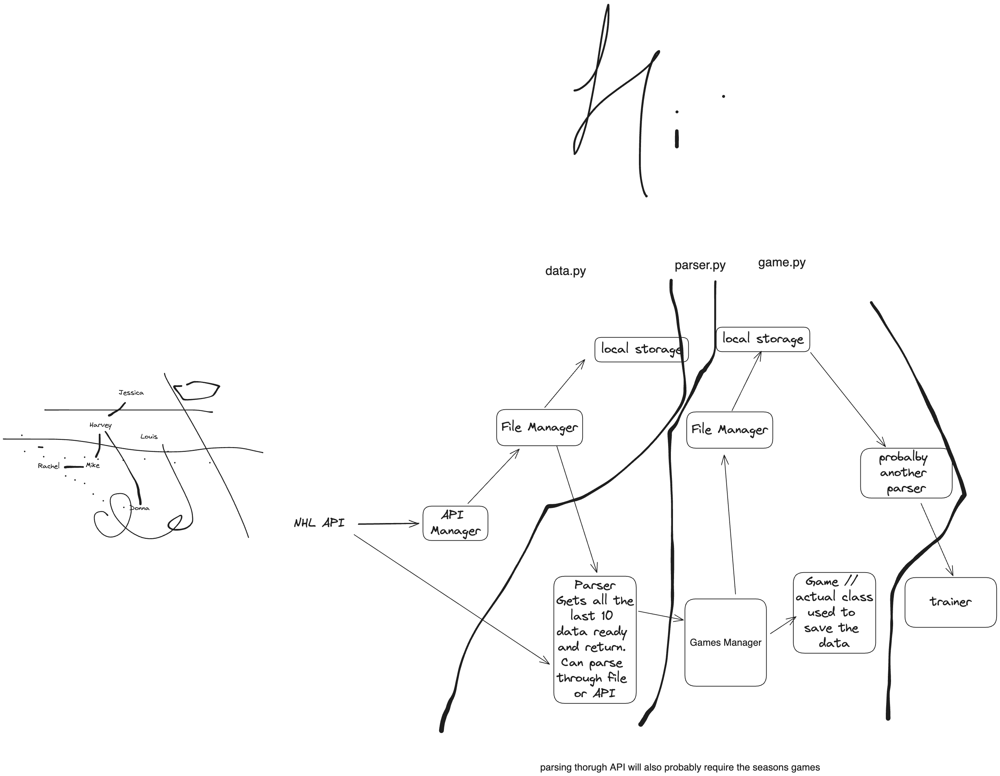

# Idea

Train NHL API using last 7 games as NHL teams are very streaky

## Features

- Shot differential (maybe normalize) Shots for / Total Shots for and against
- Best 5 players point totals from the previous 7 games, maybe normalize out of like 50 or something
- Current place in season
- Save percentage
- Home/Away (I think)
- Last 7 win percentage
- Game in season percentage

- Win percentage season culmative
- Current league wide standing

    #* Top 5 scorers in points last 10. Method one, just find last 10 games, method 2 keep a point tracker class for every players last 10 games
    #* Save percentage
    #* Shots for
    #* Shots against
    #* Home/Away (1,0)
    #* Goals for
    #* Goals against
    #* last 10 win count
    #* last 10 tie count
    #* Game in the season (by percentage)
    #*
    #? Need to do seperately
    #* Win percentage (Season culmative) -> maybe just do this one

    #! Todo but probably a lot harder to do
    #* Current League wide standing
    #* Current goalie starting

## Useful APIs
https://github.com/Zmalski/NHL-API-Reference?tab=readme-ov-file#get-standings-by-date
- Has a ton of useful data such as l10

Actual game information https://github.com/Zmalski/NHL-API-Reference?tab=readme-ov-file#get-boxscore

Useful later:
curl -L -X GET "https://api-web.nhle.com/v1/partner-game/US/now"

## USEFUL NOTES
NHL GAMES START AT 1
